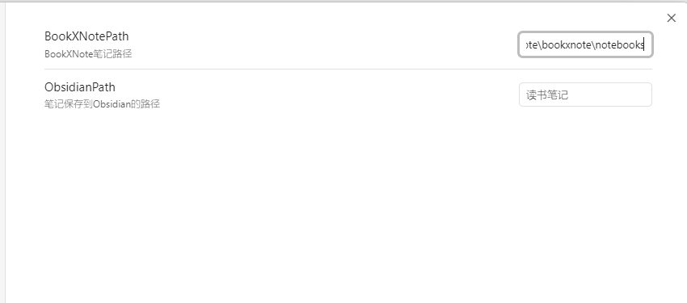
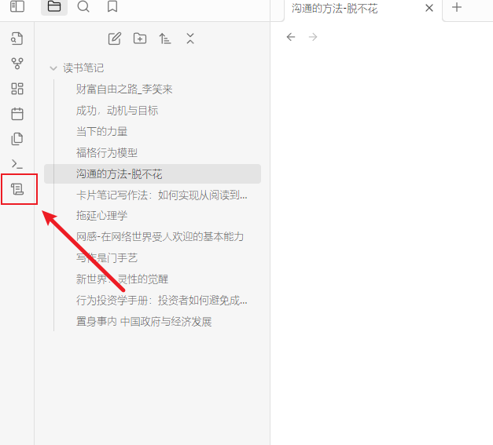

# BookXNote
BookXNote 是一款优秀的读书笔记软件，可以在读书的同时快速做读书笔记，支持PDF、epub、mobi、txt、docx等格式的电子书。

# 关于本插件
本插件是BookXNote的插件，可以把保存在BookXNote中的笔记一键同步到Obsidian中

# 如何使用
### 1. 安装插件
### 2. 启动插件
### 3. 设置插件
找到booxnote的笔记本路径，找到笔记文件夹，以notebooks结尾，例如
`C:\Users\user\documents\bookxnote\notebooks` 替换成自己的路径

### 4. 同步笔记

